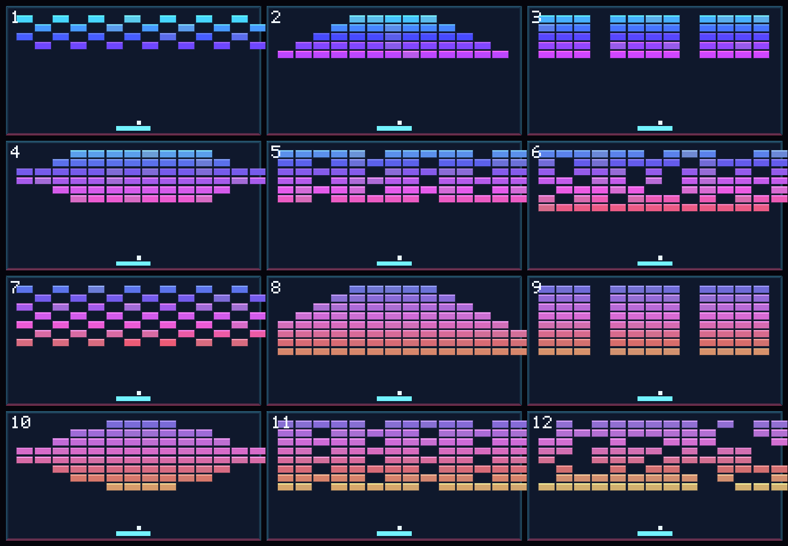

# Neon Breaker

Неоновый арканоид на **Godot 4.7** (собран и проверен на **4.7.2**). Полностью процедурная графика и звук: в проекте нет ни одного спрайта, текстуры или музыкального файла — всё рисуется кодом (`_draw()`), а звуки синтезируются скриптом.



> Картинка выше — **не скриншот игры**, а раскладка уровней, отрисованная по данным, которые выдал движок (`LevelGen` + константы `Boot`): позиции кирпичей, платформы и мяча настоящие, но кадр собран Python-скриптом, потому что в песочнице нет GPU и драйверов OpenGL/Vulkan. Скриншот игрового кадра получится только на вашей машине.

## Что внутри

- **12 уровней** с шестью схемами расстановки (шахматка, пирамида, ромб, волны, колонны, шум), кирпичи с HP 1–3, детерминированная генерация: уровень N всегда одинаковый.
- **Управление** клавиатурой, мышью и геймпадом — переключение автоматически по последнему использованному устройству.
- **Физика мяча** на `move_and_collide` с ручным отражением: угол отскока от платформы зависит от точки попадания (±62°), почти горизонтальные траектории отсекаются, скорость растёт с уровнем (420 → 900 px/s).
- **Бонусы** (22% из разбитого кирпича): широкая платформа, три мяча, замедление, +1 жизнь.
- **Комбо-множитель** до ×5 за серию кирпичей без касания платформы, всплывающие очки, рекорд в `user://neon_breaker.cfg`.
- **Сочность**: тряска камеры по «травме», частицы `CPUParticles2D`, шлейф мяча (`Line2D` с градиентом), подсветка кирпичей при ударе, squash платформы, анимированный фон со сканирующей линией, HDR-2D и glow через `WorldEnvironment`.
- **Меню, пауза, победа/проигрыш**, баннеры уровней, шторка при переходе между экранами.
- **128 headless-проверок** в двух наборах тестов (логика + интеграция).

## Запуск

Нужен Godot 4.7+ (обычная сборка, не .NET).

```bash
godot --path .        # запустить игру
godot --path . -e     # открыть редактор
```

При первом открытии в редакторе Godot сам импортирует `assets/audio/*.wav` и `assets/icon.svg`.

### Тесты

```bash
GODOT=/path/to/godot ./tools/run_tests.sh

# или вручную
godot --headless --path . res://tests/test_runner.tscn          # 94 проверки логики
godot --headless --path . res://tests/integration_runner.tscn   # 34 проверки сцены
```

Оба набора возвращают код 0 при успехе и 1 с перечислением проваленных проверок.

Что покрыто: геометрия арены и сетки, карта ввода, генерация всех 12 уровней (уникальность и границы ячеек, детерминизм), урон и разрушение кирпичей, отскок мяча от платформы с прицеливанием, счёт и комбо, все четыре бонуса, потеря мяча и жизнь, переход на следующий уровень, сохранение рекорда, а также полный цикл меню → игра → пауза → снятие паузы → проигрыш → возврат в меню с синтетическим вводом.

## Управление

| Действие | Клавиатура | Геймпад |
| --- | --- | --- |
| Движение платформы | `A` / `D`, `←` / `→`, мышь | левый стик |
| Запуск мяча | `Пробел`, `Enter`, ЛКМ | `A` |
| Пауза | `Esc`, `P` | `Start` |
| Звук вкл/выкл | `M` | — |

## Структура

```
neon_breaker/
├── project.godot              # настройки, автолоады, карта ввода, слои физики
├── scenes/
│   ├── main.tscn              # точка входа: фон, камера, игра, UI
│   ├── game.tscn              # арена: стены, платформа, контейнеры
│   ├── paddle.tscn  ball.tscn  brick.tscn  powerup.tscn
│   └── ui/menu.tscn  ui/hud.tscn  ui/overlay.tscn
├── scripts/
│   ├── boot.gd                # автолоад: константы + гарантия карты ввода
│   ├── save_game.gd           # автолоад: рекорд и настройки
│   ├── audio_manager.gd       # автолоад: пул плееров, SFX
│   ├── main.gd  game.gd  level_gen.gd
│   ├── paddle.gd  ball.gd  brick.gd  powerup.gd
│   ├── hud.gd  menu.gd  overlay.gd  lives_display.gd
│   └── background.gd  shake_camera.gd
├── tests/test_runner.gd  tests/integration_runner.gd
├── tools/generate_sfx.py      # синтез звуков
├── tools/dump_level_layout.gd # выгрузка раскладки уровней в JSON
├── tools/render_level_preview.py
├── tools/run_tests.sh
└── assets/audio/*.wav  assets/icon.svg  docs/preview_levels.png
```

### Слои физики

| Слой | Кто | Маска |
| --- | --- | --- |
| 1 `world` | мяч, кирпичи, стены | у мяча 1+2 |
| 2 `paddle` | платформа | 0 |
| 3 `pickups` | бонусы | 2 (только платформа) |

## Звук

Девять звуков в `assets/audio/` сгенерированы скриптом `tools/generate_sfx.py` (моно, 44.1 кГц, 16 бит; осцилляторы и огибающие, только стандартная библиотека Python):

```bash
python3 tools/generate_sfx.py
```

## Инструменты

```bash
# Раскладка уровней в JSON (позиции кирпичей, HP, оттенки)
godot --headless --path . res://tools/dump_level_layout.tscn | grep '^{"arena' > layout.json

# Картинка-превью по этому JSON
python3 tools/render_level_preview.py layout.json preview_levels.png
```

## Что проверено, а что нет

Проверено настоящим движком (Godot 4.7.2, сборка из исходников, режим `--headless`):

- импорт всех ресурсов (`--import`) проходит без ошибок и предупреждений;
- оба набора тестов зелёные (128 проверок);
- `main.tscn` проигрывается 240 кадров без ошибок и предупреждений в консоли.

Не проверено в песочнице: картинка на экране. В окружении сборки нет GPU, драйверов OpenGL/Vulkan и виртуального дисплея, поэтому движок запускался только headless (dummy-рендерер) — визуальную часть, glow, частицы и шлейф нужно смотреть глазами на вашей машине. Если после запуска что-то в картинке будет не так, пишите — поправлю по описанию или по вашему скриншоту.

## Заметки

- Проект использует **Forward+** и `rendering/viewport/hdr_2d=true`. На рендерере **Compatibility** 2D-glow не работает: игра останется играбельной, но будет выглядеть площе.
- Автолоад `Boot` на старте проверяет и при необходимости досоздаёт действия ввода, поэтому игра не сломается, если карту ввода отредактировать.
- Клавиатура и мышь не конфликтуют: платформа переключается на тот способ управления, который вы использовали последним.
